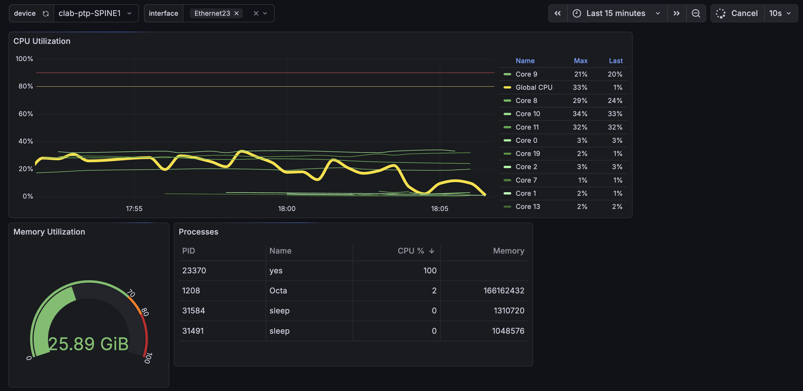
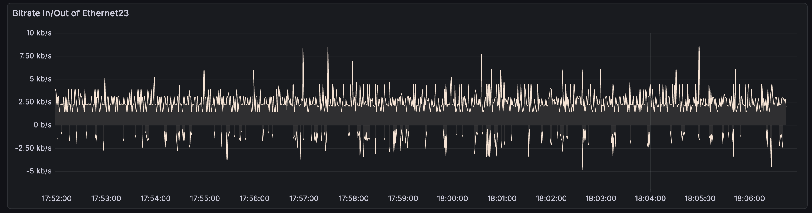
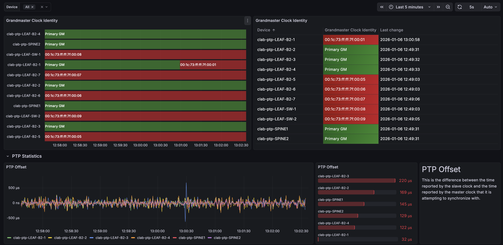
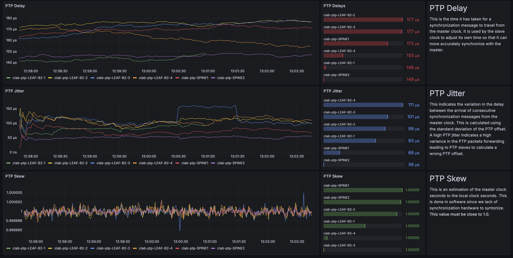

# Arista Streaming Telemetry using InfluxDB and Grafana
### Device Dashboard


### PTP Dashboard



### Instructions

> The InfluxDB Docker container runs as user influxdb with UID/GID 1500. When mounting volumes for persistent storage, ensure the mounted directory on the host is owned by UID/GID 1500, or InfluxDB may not have permission to write data.

https://docs.influxdata.com/influxdb/v1/introduction/install/docker/#volume-permissions

Run `sudo chown -R 1500:1500 influxdb/data` before `docker compose up -d`.

### Remark

Some metrics sent by EOS to Telegraf are not successfully written to InfluxDB.
Example with path `/system/aaa/authorization/state` from `openconfig-system`:
```
system,path=/system/aaa/authorization/state,source=clab-ptp-SPINE1 system/aaa/authorization/state/grpc_authz_policy_version="",system/aaa/authorization/state/grpc_authz_policy_created_on=0i 1767701933432188928
2026-01-06T12:32:46Z E! [outputs.influxdb_v2] failed to write metrics to default (will be dropped: 400 Bad Request): invalid: write buffer error: parsing for line protocol failed
```
